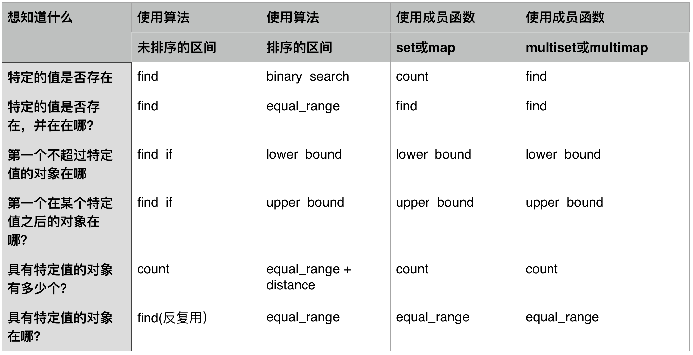

## 其他操作

#### memset
``` C++
void * memset ( void * ptr, int value, size_t num );
memset(ptr,0xff,sizeof(ptr));
```
使用memset初始化vector
``` C++
vector<int> vec(10,1);
memset(vec.data(),0,vec.size()*sizeof(int));
```
# #include<bits/stdc++.h> 

需要注意的是：对于set和map而言，find并不是第一个满足条件的对象位置，而是其中的任意一个对象。
## <algorithm>
Standard Template Library: Algorithms

### Non-modifying sequence operations:

#### for_each
``` C++
void out(int i){	
	cout << i << endl;
}

int main(){
	int a[] = {1, 2, 3, 5, 4};
	for_each(a, a+5, out);
	
	vector<int> b;
	b.push_back(1);
	b.push_back(2);
	b.push_back(3);
	for_each(b.begin(), b.end(), out);
	return 0;
}
```

#### find
``` C++
    std::vector<int>::iterator it;
    it = find (myvector.begin(), myvector.end(), 30);
```

#### find_if
``` C++
bool IsOdd (int i) {
  return ((i%2)==1);
}

std::vector<int>::iterator it = std::find_if (myvector.begin(), myvector.end(), IsOdd);
```

#### find_first_of
``` C++
bool comp_case_insensitive (char c1, char c2) {
  return (std::tolower(c1)==std::tolower(c2));
}

int main () {
  int mychars[] = {'a','b','c','A','B','C'};
  std::vector<char> haystack (mychars,mychars+6);
  std::vector<char>::iterator it;

  int needle[] = {'D'};

  // using default comparison:
  it = find_first_of (haystack.begin(), haystack.end(), needle, needle+1);

  if (it!=haystack.end())
    std::cout << "The first match is: " << *it << '\n';

  // using predicate comparison:
  it = find_first_of (haystack.begin(), haystack.end(),
                      needle, needle+1, comp_case_insensitive);

  if (it!=haystack.end())
    std::cout << "The first match is: " << *it << '\n';

  return 0;
}
```


